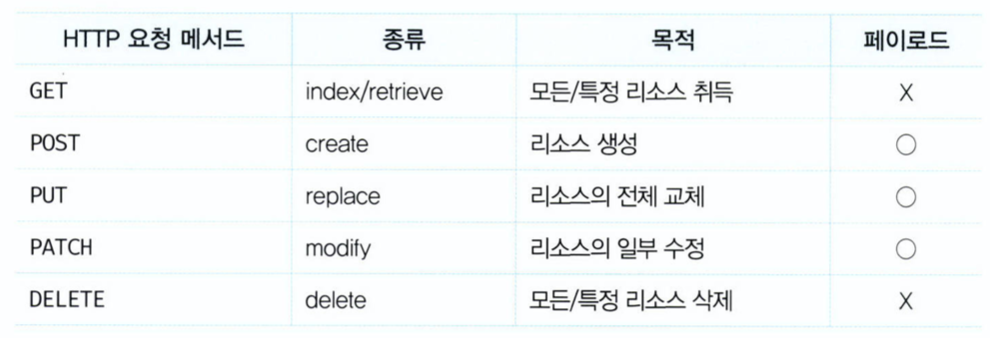

# REST API

### REST

: HTTP기반으로 클라이언트가 서버의 리소스에 접근하는 방식을 규정한 아키텍처

### REST API

: REST를 기반으로 서비스 API를 구현하는 것을 의미

<br />

## REST API의 구성

REST는 자체 표현 구조로 구성되어 REST API만으로 HTTP 요청의 내용을 이해할 수 있다.

- 자원(resource)
- 행위(verb)
- 표현(representations)


<br />

## REST API 설계원칙

1. URI은 리소스를 표현해야 한다.

- 리소스를 식별할 수 있는 이름은 동사보다는 명사를 사용한다.

```
# bad
GET /getTodos/1
GET /todos/show/1

# good
GET /todos/1
```

2. 리소스에 대한 행위는 HTTP 요청 메서드로 표현한다.

- HTTP 요청 메서드는 클라이언트가 서버에게 요청의 종류와 목적을 알리는 방법이다. 주로 5가지 요청 메서드를 사용하여 CRUD를 구현한다.
  

- 리소스에 대한 행위는 URI가 아니라 HTTP 요청 메서드를 통해 표현한다.

```
# bad
GET /todos/delete/1

# good
DELETE /todos/1
```

<br />

## JSON Server를 이용한 REST API 실습

### JSON SERVER 설치

```bash
$ mkdir json-server-exam && cd json-server-exam
$ npm init -y
$ npm install json-server --save-dev
```

<br />

### db.json 파일 생성

- 프로젝트 루트 폴더 (/json-server-exam)에 db.json 생성
- db.json 파일은 **리소스 제공하는 데이터베이스 역할**

```json
{
  "todos": [
    {
      "id": 1,
      "content": "HTML",
      "completed": true
    },
    {
      "id": 2,
      "content": "CSS",
      "completed": false
    },
    {
      "id": 3,
      "content": "Javascript",
      "completed": true
    }
  ]
}
```

<br />

### JSON Server 실행

- JSON Server가 데이터베이스 역할을 하는 db.json 파일의 변경을 감지하게 하려면 watch 옵션 추가
- 기본 포트는 3000

  ```bash
  $ json-server --watch db.json
  ```

- 포트 변경하려면 port 옵션 추가

  ```bash
  $ json-server --watch db.json --port 5000
  ```

- 매번 명령어를 입력하지 않으려면, package.json 파일의 scripts 수정
- 터미널에 `npm start` 명령어를 입력해서 JSON Server를 실행할 수 있음
  ```json
  {
    "name": "json-server-exam",
    "version": "1.0.0",
    "scripts": {
      "start": "json-server --watch db.json"
    },
    "devDependencies": {
      "json-server": "^0.16.1"
    }
  }
  ```

<br />

### GET 요청

- todos 리소스에서 **모든 todo 취득**
- JSON Server의 루트 폴더 (/json-server-exam)에 public 폴더 생성
- public 폴더에 아래의 get_index.html 추가
- 브라우저에서 http://localhost:3000/get_index.html 로 접속

```html
<!DOCTYPE html>
<html>
  <body>
    <pre></pre>
    <script>
      // XMLHttpRequest 객체 생성
      const xhr = new XMLHttpRequest();

      // HTTP 요청 초기화
      // todos 리소스에서 모든 todo를 취득(index)
      xhr.open("GET", "/todos");

      // HTTP 요청 전송
      xhr.send();

      // load 이벤트는 요청이 성공적으로 완료된 경우 발생
      xhr.onload = () => {
        // status 프로퍼티 값이 200이면 정상적으로 응답된 상태
        if (xhr.status === 200) {
          document.querySelector("pre").textContent = xhr.response;
        } else {
          console.error("Error", xhr.status, xhr.statusText);
        }
      };
    </script>
  </body>
</html>
```

- todos 리소스에서 id를 사용하여 **특정 todo 취득**
- public 폴더에 아래의 get.retrieve.html 추가
- 브라우저에서 http://localhost:3000/get_retrieve.html 접속

```html
<!DOCTYPE html>
<html>
  <body>
    <pre></pre>
    <script>
      // XMLHttpRequest 객체 생성
      const xhr = new XMLHttpRequest();

      // HTTP 요청 초기화
      // todos 리소스에서 id를 사용하여 특정 todo를 취득(retrieve)
      xhr.open("GET", "/todos/1");

      // HTTP 요청 전송
      xhr.send();

      // load 이벤트는 요청이 성공적으로 완료된 경우 발생
      xhr.onload = () => {
        // status 프로퍼티 값이 200이면 정상적으로 응답된 상태
        if (xhr.status === 200) {
          document.querySelector("pre").textContent = xhr.response;
        } else {
          console.error("Error", xhr.status, xhr.statusText);
        }
      };
    </script>
  </body>
</html>
```

<br />

### POST 요청

- todos 리소스에 **새로운 todo 생성**
- POST 요청 시에는 setRequestHeader 메서드를 사용하여 요청 몸체에 담아 서버로 전송할 페이로드의 MIME 타입 지정해야 함
- public 폴더에 post.html 추가
- 브라우저에서 http://localhost:3000/post.html 접속

```html
<!DOCTYPE html>
<html>
  <body>
    <pre></pre>
    <script>
      // XMLHttpRequest 객체 생성
      const xhr = new XMLHttpRequest();

      // HTTP 요청 초기화
      // todos 리소스에 새로운 todo를 생성
      xhr.open("POST", "/todos");

      // 요청 몸체에 담아 서버로 전송할 페이로드의 MIME 타입 지정
      xhr.setRequestHeader("content-type", "application/json");

      // HTTP 요청 전송
      // 새로운 todo를 생성하기 위해 페이로드를 서버에 전송
      xhr.send(JSON.stringify({ id: 4, content: "Angular", completed: false }));

      // load 이벤트는 요청이 성공적으로 완료된 경우 발생
      xhr.onload = () => {
        // status 프로퍼티 값이 200(OK) 또는 201(Created)이면 정상적으로 응답된 상태
        if (xhr.status === 200 || xhr.status === 201) {
          document.querySelector("pre").textContent = xhr.response;
        } else {
          console.error("Error", xhr.status, xhr.statusText);
        }
      };
    </script>
  </body>
</html>
```

<br />

### PUT 요청

- **특정 리소스 전체 교체**
- 아래 코드에서는 todos 리소스에서 id로 todo를 특정하여 id를 제외한 리소스 전체 교체
- PUT 요청 시에는 setRequestHeader 메서드 사용하여 요청 몸체에 담아 서버로 전송할 페이로드의 MIME 타입 지정
- public 폴더에 put.html 추가
- 브라우저에서 http://localhost:3000/put.html 접속

```html
<!DOCTYPE html>
<html>
  <body>
    <pre></pre>
    <script>
      // XMLHttpRequest 객체 생성
      const xhr = new XMLHttpRequest();

      // HTTP 요청 초기화
      // todos 리소스에서 id로 todo를 특정하여 id를 제외한 리소스 전체를 교체
      xhr.open("PUT", "/todos/4");

      // 요청 몸체에 담아 서버로 전송할 페이로드의 MIME 타입을 지정
      xhr.setRequestHeader("content-type", "application/json");

      // HTTP 요청 전송
      // 리소스 전체를 교체하기 위해 페이로드를 서버에 전송
      xhr.send(JSON.stringify({ id: 4, content: "React", completed: true }));

      // load 이벤트는 요청이 성공적으로 완료된 경우 발생
      xhr.onload = () => {
        // status 프로퍼티 값이 200이면 정상적으로 응답된 상태
        if (xhr.status === 200) {
          document.querySelector("pre").textContent = xhr.response;
        } else {
          console.error("Error", xhr.status, xhr.statusText);
        }
      };
    </script>
  </body>
</html>
```

<br />

### PATCH 요청

- **특정 리소스 일부 수정**
- 아래 코드에서는 todos 리소스의 id로 todo를 특정하여 completed만 수정
- PATCH 요청 시에는 setRequestHeader 메서드를 사용하여 요청 몸체에 담아 서버로 전송할 페이로드의 MIME 타입 지정
- public 폴더에 patch.html 추가
- 브라우저에서 http://localhost:3000/patch.html 접속

```html
<!DOCTYPE html>
<html>
  <body>
    <pre></pre>
    <script>
      // XMLHttpRequest 객체 생성
      const xhr = new XMLHttpRequest();

      // HTTP 요청 초기화
      // todos 리소스의 id로 todo를 특정하여 completed만 수정
      xhr.open("PATCH", "/todos/4");

      // 요청 몸체에 담아 서버로 전송할 페이로드의 MIME 타입을 지정
      xhr.setRequestHeader("content-type", "application/json");

      // HTTP 요청 전송
      // 리소스를 수정하기 위해 페이로드를 서버에 전송해야 한다.
      xhr.send(JSON.stringify({ completed: false }));

      // load 이벤트는 요청이 성공적으로 완료된 경우 발생한다.
      xhr.onload = () => {
        // status 프로퍼티 값이 200이면 정상적으로 응답된 상태다.
        if (xhr.status === 200) {
          document.querySelector("pre").textContent = xhr.response;
        } else {
          console.error("Error", xhr.status, xhr.statusText);
        }
      };
    </script>
  </body>
</html>
```

<br />

### DELETE 요청

- todos 리소스에서 **id를 사용하여 todo 삭제**
- public 폴더에 delete.html 추가
- 브라우저에서 http://localhost:3000/delete.html 접속
